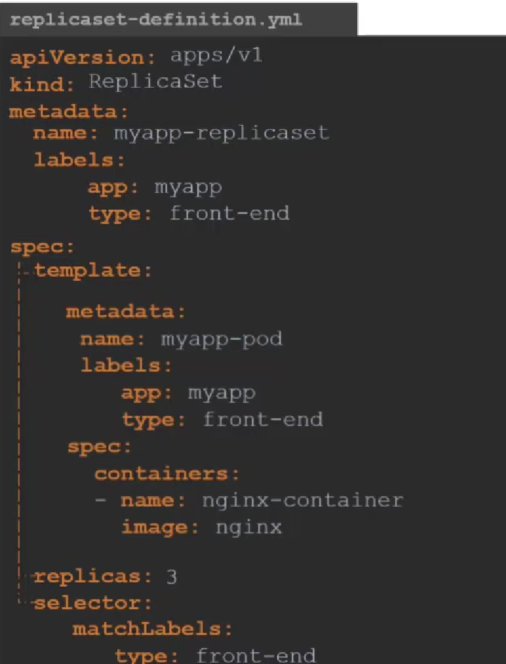

# Kubernetes comonents

## Core concepts
API server - 1 point of access

ETCD - KV storage for kubernetes info

Control plain (various controller for ex. replica  controller) - controller of pod states

Scheduler - planning the workload on nodes

Kubelet - run the container
Kubeproxy - run network rules for contaners

### Kubernetes debugging tools

netshoot https://github.com/nicolaka/netshoot
nsenter  https://github.com/pabateman/kubectl-nsenter

### CRI
Container runtime enviroment
containerd 
for cli use nerdctl

crictl - works with CRI debug tool works with kubelet

Docker vs crictl

###  ETCD
KV store

HOw to run

Operate ETCD V2

There is a 2 version of API 3 an 2
Change API version

Operate ETCD V3

ETCD commands
For example, ETCDCTL version 2 supports the following commands:

etcdctl backup
etcdctl cluster-health
etcdctl mk
etcdctl mkdir
etcdctl set

Whereas the commands are different in version 3

etcdctl snapshot save
etcdctl endpoint health
etcdctl get
etcdctl put

To set the right version of API set the environment variable ETCDCTL_API command

export ETCDCTL_API=3

When the API version is not set, it is assumed to be set to version 2. And version 3 commands listed above don’t work. When API version is set to version 3, version 2 commands listed above don’t work.

Apart from that, you must also specify the path to certificate files so that ETCDCTL can authenticate to the ETCD API Server. The certificate files are available in the etcd-master at the following path. We discuss more about certificates in the security section of this course. So don’t worry if this looks complex:

--cacert /etc/kubernetes/pki/etcd/ca.crt
--cert /etc/kubernetes/pki/etcd/server.crt
--key /etc/kubernetes/pki/etcd/server.key

So for the commands, I showed in the previous video to work you must specify the ETCDCTL API version and path to certificate files. Below is the final form:

kubectl exec etcd-controlplane -n kube-system -- sh -c "ETCDCTL_API=3 etcdctl get / --prefix --keys-only --limit=10 --cacert /etc/kubernetes/pki/etcd/ca.crt --cert /etc/kubernetes/pki/etcd/server.crt --key /etc/kubernetes/pki/etcd/server.key"

### API Server

### Cube controller manager

Basic actions
1) Watch status
2) Remediate Situatuion
Node controller

All controller

All controllers aggregate inside Kube-Controller Manager

### Kube Scheduler
its filtering and ranking nodees while applying the pods

also watch the 

and more

 
### Kubelet
runs CRI on worker node.
whith kubeadm it does not deploy automaticly so we need to download binaary and run it as service

### Kube-proxy
proovide network rules ect. iptables 

### Pods

run a single pod
kubectl run nginx --image=nginx

### REepicaSet ReplicationController

RC

RS

Replicaset also can manage other pods by selector

Scale RS

comands

Generate yaml from kubectl run
Create an NGINX Pod

kubectl run nginx --image=nginx

Generate POD Manifest YAML file (-o yaml). Don’t create it(–dry-run)

kubectl run nginx --image=nginx --dry-run=client -o yaml

Create a deployment

kubectl create deployment --image=nginx nginx

Generate Deployment YAML file (-o yaml). Don’t create it(–dry-run)

kubectl create deployment --image=nginx nginx --dry-run=client -o yaml

Generate Deployment YAML file (-o yaml). Don’t create it(–dry-run) and save it to a file.

kubectl create deployment --image=nginx nginx --dry-run=client -o yaml > nginx-deployment.yaml

Make necessary changes to the file (for example, adding more replicas) and then create the deployment.

kubectl create -f nginx-deployment.yaml

OR

In k8s version 1.19+, we can specify the –replicas option to create a deployment with 4 replicas.

kubectl create deployment --image=nginx nginx --replicas=4 --dry-run=client -o yaml > nginx-deployment.yaml

### Services

Service Types 
Node port 
ClusterIP
Load Balancer

NodePort overview

ClusterIP is default services wich provides to access by name

### namespace 

quoting

create pod in a namespace k run --image=redis redis -n finance

kubectl get pods --all-namespaces