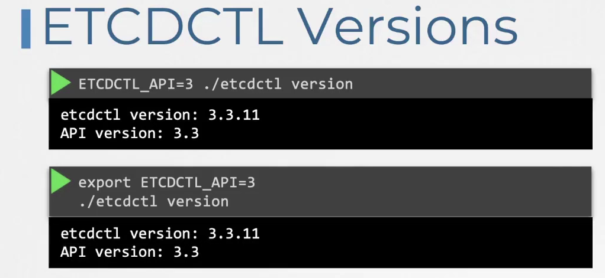
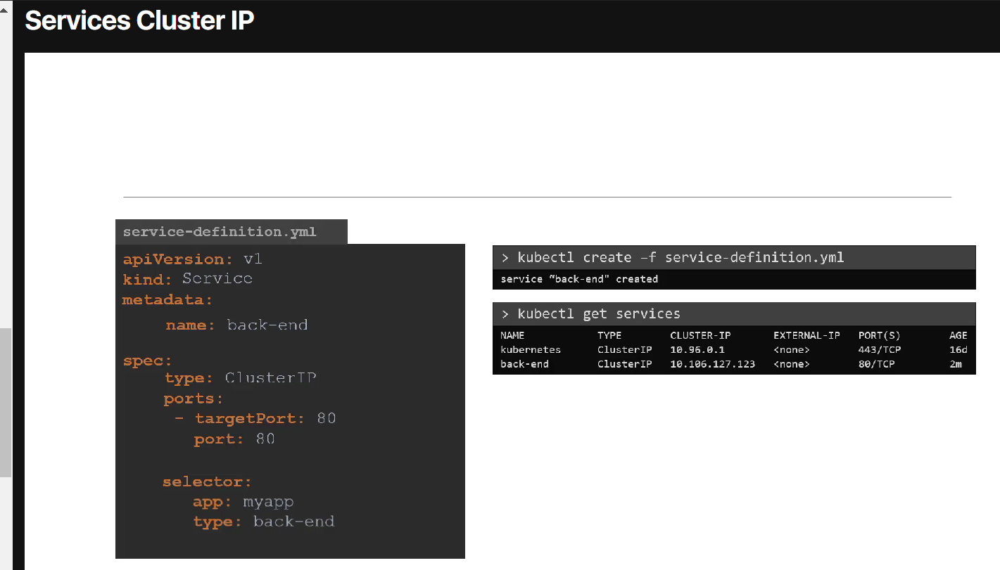
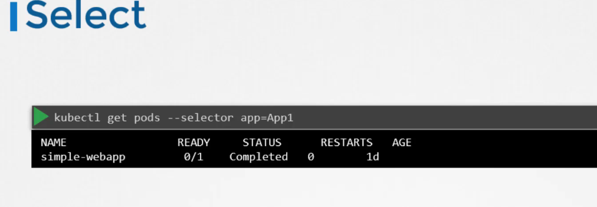
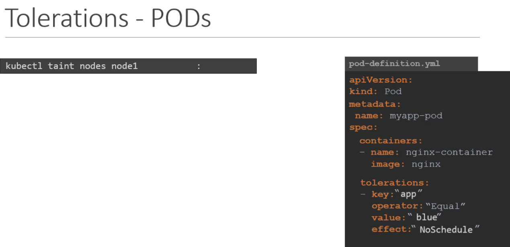

# Kubernetes comonents

## Core concepts
API server - 1 point of access

ETCD - KV storage for kubernetes info

Control plain (various controller for ex. replica  controller) - controller of pod states

Scheduler - planning the workload on nodes

### Tweaks

Kubelet - run the container
Kubeproxy - run network rules for contaners
krew
ktx
kns

create manifests
pod deployment
kubectl run nginx --image=nginx --dry-run=client -o yaml
kubectl create deployment --image=nginx nginx --dry-run=client -o yaml
service
kubectl create service clusterip redis --tcp=6379:6379 --dry-run=client -o yaml
kubectl expose pod redis --port=6379 --name redis-service --dry-run=client -o yaml
kubectl expose pod nginx --type=NodePort --port=80 --name=nginx-service --dry-run=client -o yaml
kubectl create service nodeport nginx --tcp=80:80 --node-port=30080 --dry-run=client -o yaml

kubectl run custom-nginx --image=nginx
kubectl expose pod custom-nginx --port=8080
kubectl create deployment  --image=kodekloud/webapp-color webapp --replicas=3 --dry-run=client -o yaml

### Kubernetes debugging tools

netshoot https://github.com/nicolaka/netshoot
nsenter  https://github.com/pabateman/kubectl-nsenter

### CRI
Container runtime enviroment
containerd 
for cli use nerdctl

crictl - works with CRI debug tool works with kubelet

Docker vs crictl

###  ETCD
KV store

HOw to run

Operate ETCD V2

There is a 2 version of API 3 an 2
Change API version

Operate ETCD V3

ETCD commands
For example, ETCDCTL version 2 supports the following commands:

etcdctl backup
etcdctl cluster-health
etcdctl mk
etcdctl mkdir
etcdctl set

Whereas the commands are different in version 3

etcdctl snapshot save
etcdctl endpoint health
etcdctl get
etcdctl put

To set the right version of API set the environment variable ETCDCTL_API command

export ETCDCTL_API=3

When the API version is not set, it is assumed to be set to version 2. And version 3 commands listed above don’t work. When API version is set to version 3, version 2 commands listed above don’t work.

Apart from that, you must also specify the path to certificate files so that ETCDCTL can authenticate to the ETCD API Server. The certificate files are available in the etcd-master at the following path. We discuss more about certificates in the security section of this course. So don’t worry if this looks complex:

--cacert /etc/kubernetes/pki/etcd/ca.crt
--cert /etc/kubernetes/pki/etcd/server.crt
--key /etc/kubernetes/pki/etcd/server.key

So for the commands, I showed in the previous video to work you must specify the ETCDCTL API version and path to certificate files. Below is the final form:

kubectl exec etcd-controlplane -n kube-system -- sh -c "ETCDCTL_API=3 etcdctl get / --prefix --keys-only --limit=10 --cacert /etc/kubernetes/pki/etcd/ca.crt --cert /etc/kubernetes/pki/etcd/server.crt --key /etc/kubernetes/pki/etcd/server.key"

### API Server

### Cube controller manager

Basic actions
1) Watch status
2) Remediate Situatuion
Node controller

All controller

All controllers aggregate inside Kube-Controller Manager

### Kube Scheduler
its filtering and ranking nodees while applying the pods

also watch the 

and more

 
### Kubelet
runs CRI on worker node.
whith kubeadm it does not deploy automaticly so we need to download binaary and run it as service

### Kube-proxy
proovide network rules ect. iptables 

### Pods

run a single pod
kubectl run nginx --image=nginx

### REepicaSet ReplicationController

RC

RS

Replicaset also can manage other pods by selector

Scale RS

comands

Generate yaml from kubectl run
Create an NGINX Pod

kubectl run nginx --image=nginx

Generate POD Manifest YAML file (-o yaml). Don’t create it(–dry-run)

kubectl run nginx --image=nginx --dry-run=client -o yaml

Create a deployment

kubectl create deployment --image=nginx nginx

Generate Deployment YAML file (-o yaml). Don’t create it(–dry-run)

kubectl create deployment --image=nginx nginx --dry-run=client -o yaml

Generate Deployment YAML file (-o yaml). Don’t create it(–dry-run) and save it to a file.

kubectl create deployment --image=nginx nginx --dry-run=client -o yaml > nginx-deployment.yaml

Make necessary changes to the file (for example, adding more replicas) and then create the deployment.

kubectl create -f nginx-deployment.yaml

OR

In k8s version 1.19+, we can specify the –replicas option to create a deployment with 4 replicas.

kubectl create deployment --image=nginx nginx --replicas=4 --dry-run=client -o yaml > nginx-deployment.yaml

### Services

Service Types 
Node port 
ClusterIP
Load Balancer

NodePort overview

ClusterIP is default services wich provides to access by name

### namespace 

quoting

create pod in a namespace k run --image=redis redis -n finance

kubectl get pods --all-namespaces

## Scheduling
 
scheduling is apply pod to node, after that in specs we see asigned node
sceduling can be done manually only(!) when created
after that we can bind it trhoug -bind-definition.yaml 

### lables and selectors

we apply labels to each pod
Labeling

Selecting

example of selector
kubectl get pods --selector env=dev,tier=frontend --no-headers | wc -l

### Taints and toleration

taint - for not scheduling pods on nodes
toleration - for scheduling pod on particular node

maser nodes in cluster have taint:No scheduling

kubectl taint nodes node1 key1=value1:NoSchedule-
k taint nodes node01 spray-mirtein:NoSchedule
for fix
k taint nodes node01 spray=mortein:NoSchedule --overwrite

for remove 
k tanit node controlplane node-role.kubernetes.io/master:NoSchedule-

### Node Selector

basicly for chose the best nodes with resources.

nodeSelector:
    size: Large
kubectl lable nodes <node-name> <label-key>=<label-value>
we can't apply rule like not small  or large or small. For this porpouse we use Node Affinity

### Node Affinity
in a list we can past few nodes

Not small

Node Affinity Types

### Resource limits

pod definition

exceeding limits

CPU limits behavior

Memory limits behavior

limitRange
for all containers without limits

Namespace ResourceQuotas

    resources:
      requests:
        memory: "20Mi"
      limits:
        memory: "20Mi"
k describe po example

if pod was oom killed it will be at section

Last State:
    Reaseon:

if we whant to edit we can make kuebectl edit po <pod_name>
and then 

### DeamonSets
making 1 pod on each node

 kubectl get daemonsets --all-namespaces

### Static Pod

Use Case 

all static pods have name of node on the end 

also owner of pod is Node 

run from cli 
kubectl run --restart=Never --image=busybox:1.28.4 static-busybox --dry-run=client -o yaml --command -- sleep 1000 > /etc/kubernetes/manifests/static-busybox.yaml
systemctl restart kubelet

kubelet configs /var/lib/kubelet/config.yaml

### Mulitble scheduler
additional scheduler 

view Events of scheduling
kubectl get events -o wide
kubectl logs my-custom-scheduler --name-space=kube-system

Scheduling proccess
pod>  scheduling Queue > filtering         >        scoring          >       bindign
      prioritySort        NodeResoourcesFit           NodeResourcesFit        DefaultBinder
                          NodeName                    ImageLocality
                          NodeUnscheduleble       

## Monitoring

Default in-memory monitoring solution is
metrics-server
install

view 

kubectl logs pod_name

## Kuberntes apps lifecycle
basicly via deployment
recreate and rolling update
through deployment strategy
StrategyType:           RollingUpdate\Recreate
RollingUpdateStrategy:  25% max unavailable, 25% max surge

Rollback

pass command to container via CMD

Enrypoint 

overwrite entrypoint

 
 pass comands to pod
 
 overwirte entrypoint in pod
 
   
also we can write down like this
apiVersion: v1
kind: Pod 
metadata:
  name: ubuntu-sleeper-3
spec:
  containers:
  - name: ubuntu
    image: ubuntu
    command:
      - "sleep"
      - "1200"

kubectl delete pod NAME --grace-period=0 --force  

replace 
k replace --force -f /tmp/kubectl-edit-2342526.yaml

### ENV
it's an array

get env from CM or secret

### Configmap
create Cm

imperative

declarative 

inject in podW

Data: APP_COLOR=darkblue

Data: APP_OTHER=disregard

kubectl create configmap \
 webapp-config-map --from-literal=APP_COLOR=darkblue \
--from-literal=APP_OTHER=disregard

### Sercets

create secret imperative

create secret declarative

secrets in declarative must be encoded

View secrets

Injectintg secrets

Secrets are not encrypted!!!

Ecrypting API
https://kubernetes.io/docs/tasks/administer-cluster/encrypt-data/

to check we need too check kube-apiserver prop
 --encryption-provider-config

### Multicontainer

'''example of logging app
 ---
apiVersion: v1
kind: Pod
metadata:
  name: app
  namespace: elastic-stack
  labels:
    name: app
spec:
  containers:
  - name: app
    image: kodekloud/event-simulator
    volumeMounts:
    - mountPath: /log
      name: log-volume

  - name: sidecar
    image: kodekloud/filebeat-configured
    volumeMounts:
    - mountPath: /var/log/event-simulator/
      name: log-volume

  volumes:
  - name: log-volume
    hostPath:
      # directory location on host
      path: /var/log/webapp
      # this field is optional
      type: DirectoryOrCreate'''
patterns init container ambassador adapter init-container

## Maintaining cluster

### System upgrade

#### for safetly shutdown pod
1st kubectl drain node-1
2nd kubectl uncordon node-1
kubectl drain node01 --ignore-daemonsets

#### unschedule node
kubectl cordon node-2

versions of kubernetes

supported version and upgrading

firstly upgrading a master node
than we can ho three ways:
1 - Upgrade all worker nodes at once
2 - Upgrade one node at time
3 - add to cluster new nodes with new version (cloud)

#### upgradeing kubeadm

worker upgrade 

master upgrade

general plan from 28 to 29

https://v1-29.docs.kubernetes.io/docs/tasks/administer-cluster/kubeadm/kubeadm-upgrade/

edit repo to 29
https://v1-29.docs.kubernetes.io/docs/tasks/administer-cluster/kubeadm/change-package-repository/

nano /etc/apt/sources.list.d/kubernetes.list
set 29
then 
sudo apt update
sudo apt-cache madison kubeadm

ugrade kubeadm
sudo apt-mark unhold kubeadm && \
sudo apt-get update && sudo apt-get install -y kubeadm='1.29.0-1.1' && \
sudo apt-mark hold kubeadm

Verify that the download works and has the expected version:

kubeadm version
Verify the upgrade plan:

sudo kubeadm upgrade plan

update kubelet
 apt-get install kubelet=1.29.0-1.1
 systemctl daemon-reload
 systemctl restart kubelet

 #### Backing up

 We can backub through VELERO for resources

 ETCD
befor execute set API version
export ETCDCTL_API=3

 

 take snap
 

 restore (need to create new cluster)
 

Since our ETCD database is TLS-Enabled, the following options are mandatory:

–cacert verify certificates of TLS-enabled secure servers using this CA bundle

–cert  identify secure client using this TLS certificate file

–endpoints=[127.0.0.1:2379] This is the default as ETCD is running on master node and exposed on localhost 2379.

–key  identify secure client using this TLS key file

take snap
ETCDCTL_API=3 etcdctl --endpoints=https://[127.0.0.1]:2379 \
--cacert=/etc/kubernetes/pki/etcd/ca.crt \
--cert=/etc/kubernetes/pki/etcd/server.crt \
--key=/etc/kubernetes/pki/etcd/server.key \
snapshot save /opt/snapshot-pre-boot.db

restore
ETCDCTL_API=3 etcdctl  --data-dir /var/lib/etcd-from-backup \
snapshot restore /opt/snapshot-pre-boot.db

for restoring go to etcd.yaml manifest
/etc/kubernetes/manifests/etcd.yaml
find 
  volumes:
  - hostPath:
      path: /var/lib/etcd
      type: DirectoryOrCreate
    name: etcd-data

and type etcd-from-backup
!!!! section etcd-data!!