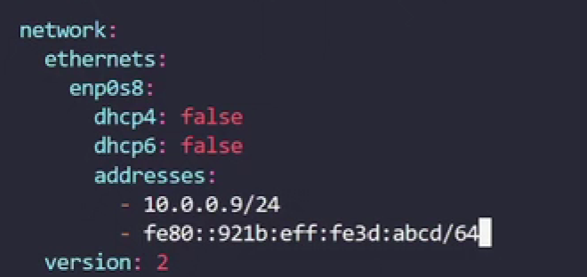

## HOST Manipulating ##
rename host
hostnamectl set-hostname NAME


## DOC Manipulatig ##
apropos - for search in all man pages
apropos -s  1,8 director for search only in 1 and 8 sections
sudo mandb - for upgrade apropos
mandb - for refresh apropos
man man (use number of section for particulary page)

## SSH manipulating ##
copy ssh key to remote host with specific user
ssh-copy-id -i ~/.ssh/id_rsa.pub 'user@domain'@10.0.1.1


## File manipulating ##
Copy with permissions
cp -p test.txt ./test_copy.txt
create directory with parent directory 
mkdir -p /tmp/1/2/3/4/5/6/7/8/9
show ls with full time 
ls --full-time
#cat EOF
HOW TO EOF in example.txt
 cat  <<EOF >example.txt
> abracadabrA
> EOF


## Permissions manipulating ##
# Change group permisson to file
chgrp wheel exapmle.txt 
#Change file user permission
sudo chown sk example.txt
#change with group
sudo chown sk:wheel example.txt
#Order for all permission
first check User > Groups > Other
!if user doest have rights to manage file
but hes group does, he will refused,
because users right does not applyble 
# Chmod base
chmod  ugo(user\group other) +-(add or remove permission) rwx(read write execute) filname
sudo chmod u+x,go-rwx
or
chomd u=rwx filname
or
chmod 777(ugo) filname
1 - execute
2 - write
4 - read
7 = 1+4+2 read write execute
5 = 4+1 read and execute
6 = 4+2 read and write
3? = execute+write (not read!)
how theese numbers calculated
r--|-w-|--x
100|010|001 biary>decimal 421

0644 - 0 special bit equals 1,2 or 4
stickyBit (+t) - 1 запрещает пользователям удалять файлы других пользователей
SGID -(g+s) 2  для файла разрешает выполнять файл с разрешениями группы. 
для группы файлы созданные в каталоге получают одного и того же владельца группы
SUID - (u+s) -4 Пользователь выполняет файл с разрешением владельца файла

## File searching with find ##
#find directory in current directory
 find . -type d -name "foo_bar"
#find files in root folder
 find / -type f -name "foo_bar"
#find case isensetive 
find / -iname "foobar"
#find inside files
zgrep -i 'bla_bla' /var/logs/*
grep -rnw '/var/logs/' -e '27e6380d5'
#grep all link strings
 grep -Eo "(http|https)://[a-zA-Z0-9./?=_%:-]*"
 #recurcevly grep
 sudo grep -r "reboot" /var/log
#find all files specific size
find /lib64/ -size +10M
10c = 10bytes\ 10k=10Kbytes\ 10M= 10Mb\ 10G = 10Gb
-size 512k -search exact 512Kb
-size +512k -searchs all grader than 512K
-size -512k - search all less 512k
## Find operators
And operator
find -size 10M -name "f*" # finds files size 10M and name starts with f
Or operator 
find -size 10M -o -name "f*" fins 10M size or name starts with f
Not operator
find -not -name "f*" #or find \! -name "f*"
#find and delete lot of file with mask
find /var/logs -name "*2022-08*" -delete 
#find all files wich modified 1 min ago
find /dev/ -mmin -5
mmin 5 = modied just 5 minues ago
mmin -5 = modified all before 5 miutes ago
mmin +5 = 5+ -5 5 min ago + all during 5 min
#find and delete files older than 5 days ago
find . -mtime +5 -delete
mitme 2 - 2 days ago
#!!!modified - change content != changed changed metadate (file permission)
find / -cmin -5 change 5 min ago
#find with permisson
find -perm 664  # find exact 664 permission not 777 or 544
find -perm -644 # finds at least 644 permission includes 777
find -perm /644 # finds files with any permission it finds 777 and 544
find -perm u=rwx, g=rw, o=r
find . -perm -444 -perm /222 ! -perm /111
find . -perm -a+r -perm /a+w ! -perm /a+x
#example find any file group can write and others cannot read or write
sudo find /var/log/ -perm /g+w ! -perm /o+rw
#Find our secret file under /home/bob. You can either look for a file that is exactly 213 kilobytes or a file that has permission 402 in octal
find -size 213k -o -perm 402
#find and exec
find in local dir and copy to another
find /home/bob/ -name "cats.txt" -exec cp "{}" /opt  \;


## Command line manipulating ##
ctrl+r reverse search in history
watch -n 5 date -run date every 5 seconds

## GIT Manipulating ##
#git hard reset to commit, find hash of commit
git history 
#reset to comit
git reset --hard <commit_hash>
#list all avalible repositories in bit bucket
 curl -k --user <username>:<password> -X GET https://bitbucket.repo.com/rest/api/1.0/projects/PROJ_NAM/repos?limit=100 | grep -Eo "(http|https)://[a-zA-Z0-9./?=_%:-]*.git"
#Get changes from master into your branch
git checkout my_feature_branch
git rebase master


## Debugging tools ##
top htop - for proccessing info
itop - for disk usage

show cpu
lscpu nproc

show file openned by proccess
lsof -p <PID>

strace <command> - tracing syscall etc.


------------------------------------------------------------


## Text manipulating ##
get md5 hash of pass
 echo "p@ssword" | md5sum | cut -d' ' -f1

tail -n 20 #show last 20 strings
tail -f follow 
head #opposit of taitl

wc - word count
wc -w -count lines

#sed
sed 's/canda/canada/g' user_info.txt #this will find all canda and replace to canada in dry-run
    s-substitute 
    g-global (withowt it will just replace first)
sed -i 's/canda/canada/g' user_info.txt # -i means directly in file

I - capital I for case isensetive. On the end like /Ig

sed -i '500,2000s/enabled/disabled/g' values.conf

cut -d ' ' -f 1 user_info.txt  # -d is for delimeter ' '-delimeter -f 1 - first 1 column

#vi
search case isensetive /search\c
:5 - goes to 5th line 
yy -for copy p for past

#grep
 grep key 'pattern' /path/to/file
 -r - recusevly
 -i - case insensetive
 -vi - invert match
 -w -for words
 -o - only match 

#regexp
- ^ search in begin of words
- $ search for the end of word
  . match any character
  \. search only period 
 * - any character any times
 /.*/ -finds all words in bracets
 0* - fins all character even without "0"
 0+ - fnds all zeros
 {min,max}
 0{3,} - shows all strings above 000 so 000 and 00000
 0{,3} - shows at most 3 zeros 00 or zero 
 0{3} - exact 000
 ? - for elamens that may occured
 disabled? - shows disable disabled and disables
 | -for or
 enabled|disabled - show all enabled and disabled words
 []-rage
 [a-z] from a to z
 c[au]t -for find cat and cut
() - subexpression
[^] - exclude from search 
http[^s] - will show only http
regexr.com
egrep -w '[A-Z][a-z]{2}' /etc/nsswitch.conf > /home/bob/filtered1
grep -ic '^SECTION' testfile > /home/bob/count_lines
 force grep to use regular re expression grep -Er
 or use egrep 

# Archiving data
#baseline of archiving create tar > compress > send to storage
list archve 
tar --list --file archive.tar
tart -tf archve.tar
#create
tar --create --file archive.tar file1= tar cf archive.tar file1
tar --append --file archive.tar file2 = tar rf archive.tar file2
create from dir sudo tar cfP logs.tar /var/log/
#extract
tar --extract --file arch.tar = tar xf arch.tar
tar --extract --file arch.tar --directory /tmp/ = tar xf acrh -C /tmp/
#compressing
3 pre install utily gzip bzip2 xz
gzip/bzip/xz file1.
for unzip add key
gzip/bzip/xz --decpress file.*
to keep original fiel  add key --keep
#zip command can zip a dir  zip -r 

For creation with tar
tar --create -gzip --file .. = tar czf ..
tar --create -bzip2 --file .. = tar cjf ..
tar --create -xz --file .. = tar cJf ..
tar --create --autocompress --file tarname_with_ext.gz/bz2/xz = tar caf ..
tar caf archive.tar.gz dir1
For extract
tar --extract --file .. = tar xf archive.tar.gz /folder

# Backing up
          <local_dir>  <User@remoteaddr:/path/to/sync/>      
rsync -a Pictures/     sk@192.1.1.1:home/sk/Pictures/

#Archiving with DD. Before dd use unmount
        input_file=device output_size
sudo dd if=/dev/sda of=disc_image.raw  bs=1M status=progress
#For unmount use reverse
sudo dd if=disc_image.raw  of=/dev/sda bs=1M status=progress

# Flow control
< stdin
2> stderr
1> stdout

for expample get rid of errors
grep -r '^The' /etc/ 2>/dev/null
grep -r '^The' /etc/ 2>error.log 1>output.log - for override
grep -r '^The' /etc/ 2>>error.log 1>>output.log - for append
grep -r '^The' /etc/ > all output 2>&1 - for compine 1 and 2

sort <<EOF  - inline stream
> 1 
> 3 
> 5 
> 2
# EOF

bc <<<1+2+3+4   -for pass an inline string

column -t - for add  tabulation and purify outputs
sort -duf -sort with case insensetive and clean from dupplicates

#issue a certificate
openssl req -x509 -newkey rsa:2048 -days 365 -keyout myprivate.key -out mycert.crt
# view cert
openssl x509 -in mycert.crt -text

#force restart reboot
systemctl reboot --force --force - instant reboot
systemctl poweroff --force --force -instant power off

shutdown 2:00 - in a AM
shutdown +15 - shutdown after 15 min
shutdown -r - for reboot
#wall message
shudtown -r +15 'Sheduled restart after 15 minuets'
cancel shutdown
shutdown -c 

##  Booting 
systemctl get-default
#change target for non graphical
sudo systemctl get-default multi-user.target  
# for backing graphical
sudo systemctl isolate graphical.target
# emergency
sudo systemctl isolate emergency.target
# rootshell
sudo systemctl isolate rescue.target

# Bootloader issue
1)Load liveCD GRUB/
2) procceed with /mnt/sysroot
then chroot /mnt/susroot

grub2-mkconfig - o /boot/grub2/grub.cfg

lsblk
find root mounted device

grub2-install /dev/sda

grub2-install /dev/vda > /home/bob/grub.txt 2>&1
dnf reinstall grub2-efi grub-efi-modules shim

# default grub config
/etc/default/grub 

## Starting up linux
main proccess is init
we have differen units such as services sockets devices and timers
for example  systemctl cat containerd.service
or  systemctl list-units and chose

Example of sshd service
[Unit]
Description=OpenBSD Secure Shell server
Documentation=man:sshd(8) man:sshd_config(5)
After=network.target auditd.service
ConditionPathExists=!/etc/ssh/sshd_not_to_be_run

[Service]
EnvironmentFile=-/etc/default/ssh
ExecStartPre=/usr/sbin/sshd -t
ExecStart=/usr/sbin/sshd -D $SSHD_OPTS
ExecReload=/usr/sbin/sshd -t
ExecReload=/bin/kill -HUP $MAINPID
KillMode=process
Restart=on-failure
RestartPreventExitStatus=255
Type=notify
RuntimeDirectory=sshd
RuntimeDirectoryMode=0755

[Install]
WantedBy=multi-user.target
Alias=sshd.service

#for managing use 
sudo systemctl edit --full sshd.service

sudo systemctl revert sshd.servic

# managing service
sudo systemctl status sshd.service
sudo systemctl start sshd.service
sudo systemctl stop sshd.service
sudo systemctl restart  sshd.service
sudo systemctl reload sshd.service

# enabling\disabling services
sudo systemctl disable sshd.service
sudo systemctl disable --now sshd.service
sudo systemctl enable sshd.service
sudo systemctl enable --now sshd.service # for enable and start

sudo systemctl mask sshd.service - it will never started by another program
sudo systemctl unmask sshd.service

sudo systemctl mask httpd.service

# check service is enabled
systemctl is-enabled sshd.service


list all avalable services
systemctl list-units --type service --all

## Create services
we cat use as template sshd
sudo cp /lib/systemd/system/ssh.service  /etc/systemd/system/myapp.service
base line to fill
[Unit]
Desc\ After\
[Service] #livecycle of app
ExecStart #binary for run
ExecReload
Restart\RestartSec
KillMode
type=simple
#after edit update deamons sudo systemctl demon-reload


## Proccess debug
ps aux - list proccesses
ps 1 
ps u 
ps -U sk -list user prccess
pgrep -a syslog 

nice -n 10 bash
ps fax

sudo renice 7 8245

kill -L -list of all kill command
proccess to bg - crtl+z
prccess fg 1
if we need running in backup past "&"
sleep 108 &
jobs - list jobs
 bg 1 - return to run in backhround
#list opened files
lsof -p <PID>
sudo lsof /var/log/messages
sudo kill -SIGHUP 959
nice -n 15 bash

sudo journalctl -p info -g '^c' > .priority/boot.log

## Crontab
you can add crontab to system
for list  crontab -l
we can add script to /etc/cron.hourly\dayly\etc
#for adding
sudo crontab -e
30 21 * * * /usr/bin/touch test_passed
#cronlogs
cron logs /var/log/cron

#for skip poweroff issue use anacron
vi /etc/anacrontab
#force run anacron
sudo anacron -n -f
we can add command at 15:00 
or at Auugust 20 2022
at 'now + 3 days'
show scheduled
 atq
 at -c 20
#remove jobs
 atrm 20

## Package managment
dpkg --listfiles nginx # list all files
dpkg --search /usr/sbin/nginx # list all files
#find nginx
apt search nginx # all matches including doc
apt search --names-only nginx

sudo apt remove ngnix
sudo apt autoremove nginx

#list repos
/etc/apt/source.list
deb - deb files
url - repo address
jammy - distro name
main\uiveerse - repo maintainers

#adding 3rd part repo 
curl "https://download.docker...gpg" -o docker.key - download the key
gpg --dearmor docker.key - transfer key to gpg format
sudo mv docker.key.gpg /etc/apt/keyrings - copy to sign trusted 
sudo vi /etc/apt/source.list.d/docker.list - add dedicated repo to source.list.d
deb [signed-by=/etc/apt/keyrings/docker.key.gpg] https://download.docker.com/linux/ubuntu jammy stable
sudo apt update
ppa - personal package archive
sudo add-apt-repository ppa:graphics-drivers/ppa
#list repos
add-apt-repository --list

#compiling from source
basics 
download source repo
add essentials utility
run autocconfig to generate configfile
 run ./configure
 make for build 
 make clean\install to clean or install

## Resources
df -h
tmpfs - ingore
pay atention to / path

du -sh /bin/  s-summarize h-human readeble

free -h --mega

uptime 
la - 1-5-15 min

lscpu
lspci

#fix filesystem
sudo xfs_repair -v /dev/vdb1
sudo fsck.ext4 -v -f -p /dev/vdb2

systemctl list-dependencies

# Kernel Runtime Parameters
sysctl -a -list kernel parameters
net. vm.fs.kernel. related parameters

#edit parameter on-run
sudo systctl -w net.ipv6.conf.default.disable_ipv6=1

man sysctl.d
edit /ect/sysctl.d/*.conf
sysctl -a | grep vm
echo vm.swapniness=15 > /etc/sysctl.d/swap-less.conf
sysctl -p /etc/sysctl.d/swap-less.conf
#or  edit sysctl.conf
sudo vi /etc/sysctl.conf
sudo sysctl -p

## SeLinux
ls -Z
ps axZ
#change groups tags
sudo chon
#check status
sestatus
#set enforcement
sudo  setenforce Permissive  
#enable 
/etc/selinux/config
#identify role 
 sudo semanage user -l
MandatoryAccessConrol
for ubuntu
sudo systemctl stop apparmor.service
sudo systemctl disable apparmor.service
sudo apt instsall selinux-basics audtd
sudo selinux-activate
reboot 
permissive \ enforcement
sudo audit2why --all
#for allow all that logged
sudo audit2allow --all -M module_name
sudo semodule -i module_name.pp
#for setting enforcement
sudo setenfoce 1
less module_name.te
#view tags users roles
seinfo -u/r/t
#set prop with refference
sudo chcon --reference=/var/log/syslog/ /var/log/auth.log
sudo restorecon -R /var/www
more info
https://docs.fedoraproject.org/en-US/quick-docs/selinux-getting-started/
https://access.redhat.com/documentation/ru-ru/red_hat_enterprise_linux/8/html/using_selinux/index

## User managment
sudo useradd john -simplify add user
sudo adduser jake - wide add with pass\prompnt
ls -a /etc/skel - template for users
 useradd --defaults -defaults parameters
 /etc/login.defs - login defaultss

## Add user with group an uid
sudo useradd -G soccer sam  --uid 5322

## Delete user with homedir
sudo useerdel john
sudo userdel --remove john = usderdel -r john

id 
whoami

sudo usermod --home /home/otherdir --move-home john

## edit primary group
sudo usermod -g rugby sam
## edit user dir login shell
sudo usermod -d /home/otherdir -m john
suod usermod --login jane john = usermod -l jane john
sudo usermod -- shell /bin/zsh jane = usermod -s /bin/zsh jane

## lock\unlock user
sudo usermod -L sam
sudo usermod --lock jane =  uleromd -L
sudo usermod --unlock jane = jsermod -U

## exp user
usermod --expiredate 2025-12-1- jane = usemod -e
YYYY-MM-DD
usermod -e "" jane - delete exp

## exp password
chage --lastday 0 jane = chnge -d 0 jane
chage --lastday -1 jane
chage --maxdays(-M) 30 - for chage every 30 days
chage --maxdays -1
chage --list(-l) - for show pass exp date
## add system accoutn
sudo useradd -r apachedev
sudo useradd --shell /bin/csh jack
## warn user before 2 days exp
sudo chage -W 2 jane


# Group managment

Primary Group
Login group
groupadd developers
## add to group
gpasswd --add(-a) john developers
groups john
john: john developers
      ^primary   ^ secondary groups

## add group with gid
sudo groupadd --gid 9875 cricket

usemod --(gid)-g developers john - change primary group
## rename group
groupmod --new-name(-n) programmers developers

## delete group
groupdel progremmers - doesn't delete if tis primary group

# Envs

printenv = env
```
$HOME
```
cat .bashrc
## add env to erveybody
vi /etc/enviroment
```
## Script for every user
vi /etc/profile.d/lastlogin.sh
echo "Your last login was at: " > $HOME/lastlogin
date >> $HOME/lastlogin
```
## Default files for new user
vi  /etc/skel/README > please be cool

sudo vi /home/trinity/.bashrc > add some scripts

export ENV_NAME=Value

## add new env from default file
source /etc/environment

# User limints

vi /etc/security/limits.conf
domain - username\@group\*
type - hard\soft\-    hard - max value soft - initial  - both
item - nproc(number of procceese)\fsize(kb)\cpu(in sec)
man limits.conf

ulimint -a

# User privileges
groups
## add to sudo 
sudo gpasswd -a trinity wheel
## remove form sudo 
sudo gpasswd -d trinity wheel

sudo visudo 
%wheel      ALL=(ALL)       ALL
^group\user ^host ^as sudo  ^list of command
trinity  ALL=(ALL) ALL
## allow no passwrd
trinity    ALL=(ALL)   NOPASSWD: ALL


# Root managing
## login as root
sudo --login
# for exact root user
su  -
# set root pass
sudo passwd root
# unlock root
sudo passwd  -u root
# lock root passwd
sudo passwd --lock root

# PAM
plugable authantifacatuation modules
/etc/pam.d/
man pam.conf
man pam <tab> for list modues
deny root to use ssh
auth    required       pam_listfile.so onerr=succeed  item=user  sense=deny  file=/etc/ssh/deniedusers
echo root > /etc/ssh/deniedusers

# LDAP
///


# Networking
## IPv4


## IPv6


## show configuring
ip link - show interfaces
lo - local
enp0s3 - physical devive
ip -c addr
## enabling interfaces
sudo ip link set dev enp0s8 up
## assign ip addreses
sudo ip address add 192.168.5.55/24 dev enp0s8
sudo ip address delete 192.168.5.55/24 dev enp0s8
## ubuntu assign ip
netplan get
ls /etc/netplan/ - yaml file



# Soring
## slect only uniqe strings in next line
uniq filname.txt 

## sorting 
sort filename.txt

## for select only uniqe enteries we need to pass 
sort filname.txt | qniq


diff -c file1 file2 # for show diff with context

sdiff file1 file2 # for side by side diff


# Add Trusted certificate
# Debian
sudo cp your.crt /usr/local/share/ca-certificates/
sudo update-ca-certificates

# for remove, remove file and
sudo update-ca-certificates --fresh

# JQ
move all uniq thead_name from json
jq .thread_name ../logs_isys_coin.json | sort| uniq > ../thread_name_coin.json


