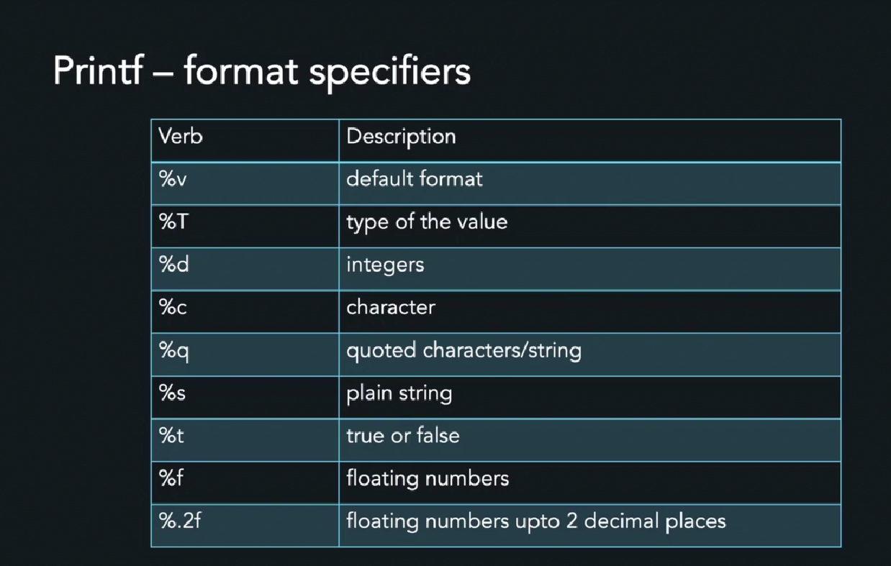
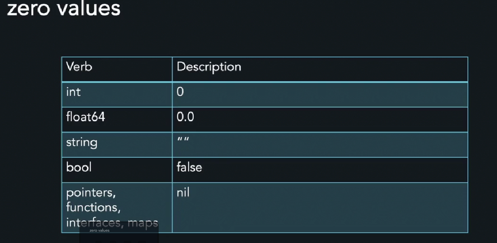
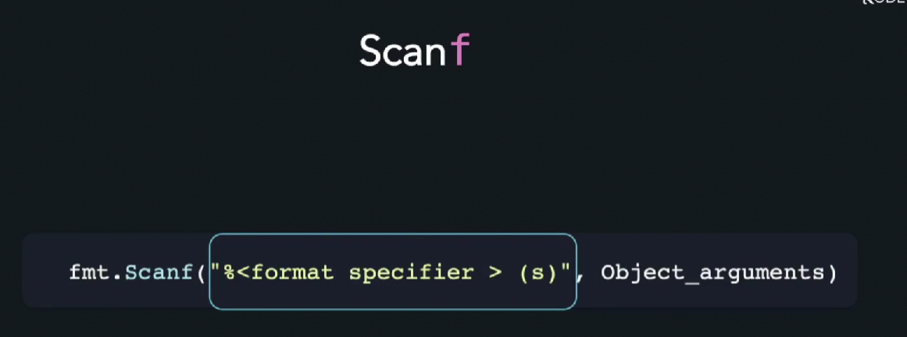
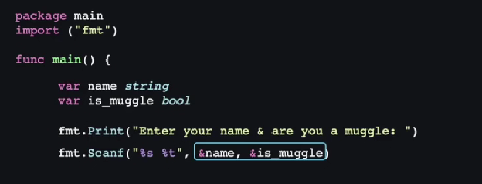
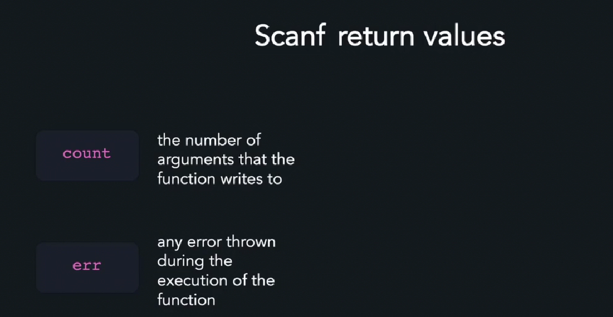
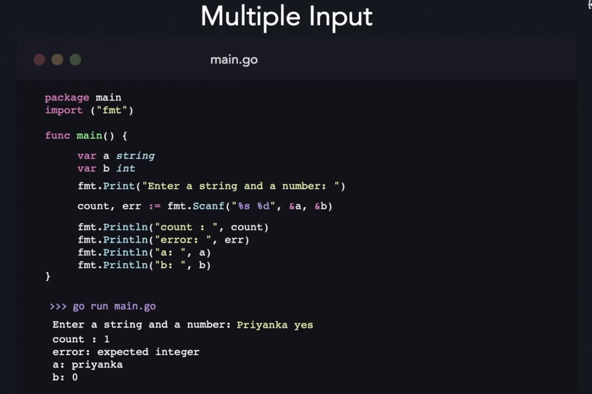

## baseline

//comment
/* multi 
string
comment*/

helloworld

package main //if executable binaries like main void in C
import "fmt" // import 	
func main() {   // declare function
    fmt.Println("hello world") // output
}

## data types

int (uint)
float float32 float64

string

bool only true/false (not 1\0)

Arrays& Slices

Maps

## Varibles

var var_name data_type = value

var High float = 13,5

var name string - "Sergey"

var i int = 100

var Dolboeb bool = false

package main 
import "fmt"

 printf formats
 %v - stardard
 %d  - decimal

package main
import "fmt"

func main() {
	var name string = "Vasa"
    var score int = 88
	fmt.Printf("Hey, %v! You have scored %d/100 in Physics", name, score)
}

## Declaring values

var s,t string = "foo","bar"

var (
    s string = "foo"
    i int = 5
)

s := "Hello World"

we can reasign values to its onw type 

name:= "Lisa"
name = "Peter"

## Var scope

Block

func main (){
    city :="London"
    {
        coutry := "UK"
        fmt.Println(country)
        fmt.Printlt(city)
        //here works city and country
    }
fmt.Println(city)
// if we reffers here to coutry we get error
}

Local Var
declared inside func or block

Global Vars
declared outside block or func 
and accesable in all program

package main
import ("fmt")

var name string = "Lisa"

func main(){
    fmt.Println(name)
}

## Zero values

bool = false 
int = 0 
flat64 = 0.0
strig  = ""

example 
        var fl float65

## User input

fmt.Scanf("%<format specifier>(s)", Object_arguments)

package main 
import "fmt"

func main(){
    var name string
    fmt.Print("Enter your name: ")
    fmt.Scanf("%ы", &name)
    fmt.Println("hello, ", name)
}

multiple input

